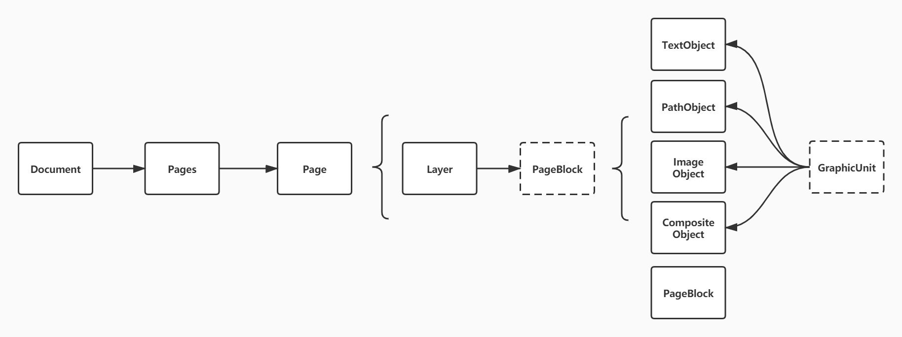
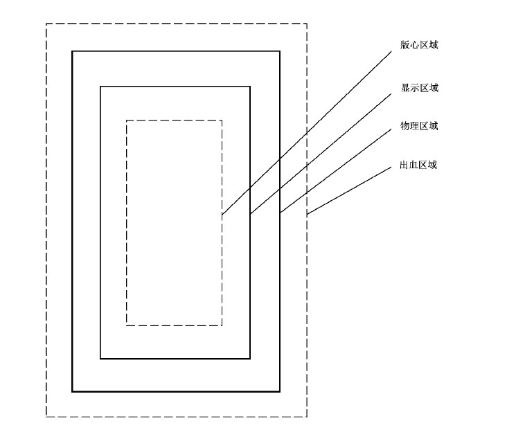
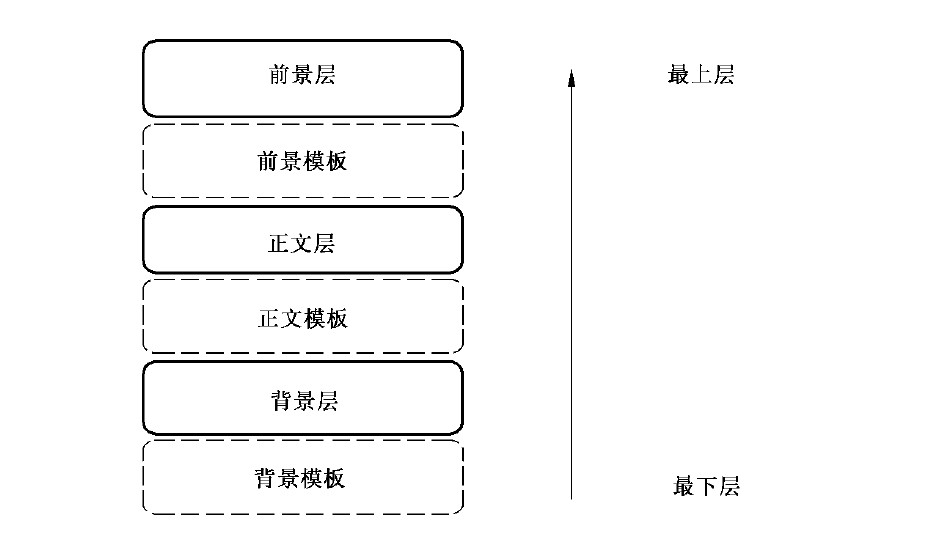

# OFD 布局设计文档

## 原始OFD结构分析

文档主要构成如下：

- *Document*: 定义了一个文档，包括文档内容、权限、文档数据等。
- *Pages*： 定义了一系列的页面，包括页面的顺序、页面描述文件所在的位置，相当于我们书本中书签一样的作用。
- *Page*： 定义一页页面，包括页面的大小，页面含有的内容。
- *Layer*: 页面中的内容之一，用于容纳页面中不同图层的内容。
- *PageBlock*: 页面中实际的元素的父类。
- *GraphicUnit*： 定义了页面元素一些基本表现。

### 页面（Page）

页面边界如下： (来自于《GBT_33190-2016_电子文件存储与交换格式版式文档.pdf》 图 8)

- 物理区域: 页面物理区域，左上角的坐标为页面空间坐标系的原点。
- 显示区域: 页面内容实际显示或打印输出的区域，位于物理区域内，包含页眉、页脚、版心等内容。
- 版心区域： 文件的正文区域，位于显示区域内。左上角坐标决定了在显示区域内的位置。
- 出血区域: 超出设备性能限制的额外出血区域，位于物理区域外。不出现时默认值为物理区域。

页面的层次结构可以通过在Document中定义并描述，也可以在每个页面中独立出现，当页面中不含页面结构层次描述时，默认从使用Document中的页面层次结构。

页面可以用下面结构进行理解:

页面主要功能:

1. 页面的大小。
2. 容纳图层。

页面本身是不容纳实际的图元，页面只是一个容器了一系列的图层，在图层中容纳各个图元。页面按照一定的图层顺序，依次渲染。

我们所有看的一个OFD页面都是页面中一系列图层按照一定顺序，渲染得到。

### 图层（Layer）

图层处于页面中用于容纳图形图像元素，也就是图元。

阅读器来解析文档时，会根据下面图层顺序进行页面的渲染。

渲染时，自下而上，依次渲染。位于上层的图层可以覆盖位于它所出图层下方的图层内容。

### 图元（GraphicUnit）

图元是OFD中页面上呈现内容的最基本单元，所有页面显示内容，包括文字、图形、图像等，都属于图元，或是图元对象的组合。

图元在图层中如下所示：

> 图层本身是只是一个逻辑概念，是不可见的，可以把它想象成一个与页面等大且透明的层。

图元主要功能是定义元素的位置，以及大小。它还可以通过变换矩阵对元素本身就进行变换，通过裁减区域对元素进行裁减。

